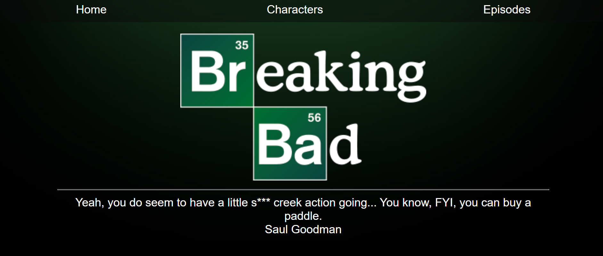
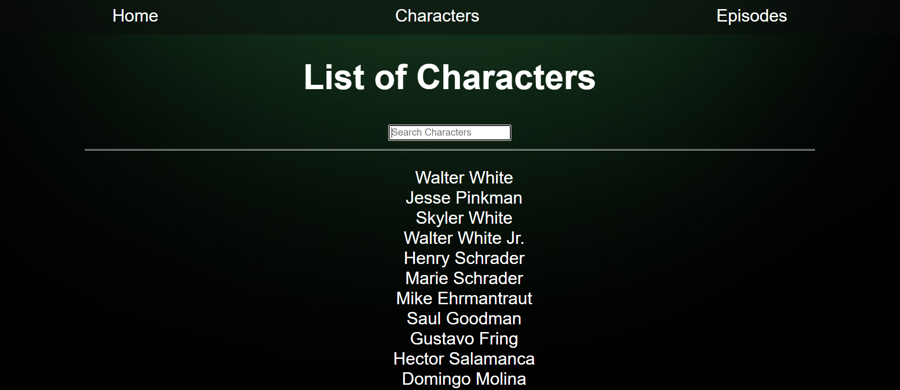
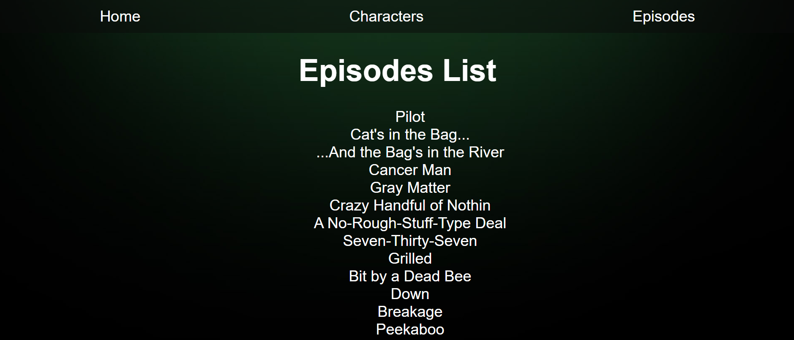

# Breaking Bad

## REACT - REDUX

La aplicacion web que consume datos de una API externa y se muestre en pantalla. A medida que vamos avanzando vamos incorporando nuevas features.

Podemos consultar la documentación de la API en la siguiente ruta:
`https://www.breakingbadapi.com/documentation`

Trabajamos en la carpeta /src. Ahi tendremos nuestro /components. Deberiamos seguir el siguiente flujo recomendado:

Recuerden hacer npm install para descargar las dependencias necesarias. Luego necesitaran hacer npm start para revisar su progreso en tiempo real con el navegador.

# App.js

Este es nuestro archivo de ruteo. Aquí tenemos nuestras rutas (el router lo definimos en el index) para con las siguientes rutas:

- **"/"** Este sera nuestro Home.
- **"/characters"** Aqui mostraremos una lista de los personajes.
- **"/characters/:id"** Esto nos llevara al detalle de cada personaje. Aqui se permite hacer modicaciones de los atributos de los personajes.
- **"/episodes"** Aqui mostraremos una lista de los episodios.
- **"/episodes/:id"** Esto nos llevara al detalle de cada episodio.
- **"/create"** Aqui mostraremos un formulario para la creación de personajes.

# Home

En esta ruta vamos a hacer la llamada a la API que nos devuelve
una quote aleatoria de la serie. Vamos a utilizar esa quote para que cada vez que entremos se muestre una diferente.

Deberia quedar asi:

  

Vamos a abrir el script Home.js en la carpeta /components/home para empezar a codearlo.

# NavBar

Se muestra en toda la app y nos  lleva a otras rutas del sitio.

# Characters

Definimos el componente Characters, que aparece al entrar en "/characters". Para eso abrimos el script Characters.js, en la carpeta /components/characters. En este script se toma la ruta de la api que devuelve la lista de personajes.
Tiene una searchbar que nos permita buscar personajes.

  

# CharacterDetail

Cada vez que hacemos click en el nombre de un personaje, nos lleva a una página con los detalles de ese personaje.

# Episodes

En la ruta /episodes vamos a mostrar una lista de todos los capítulos de la serie.
La api nos devuelve los capítulos de Better Call Saul también.

  

# Paginacion

Limitamos la cantidad de elementos que mostramos en pantalla a 8. El resto lo vamos a mostrar en siguientes paginas.

# Front-breakingbad-React-Redux
